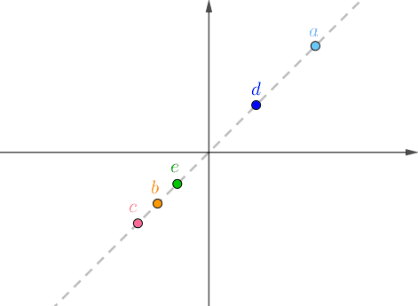
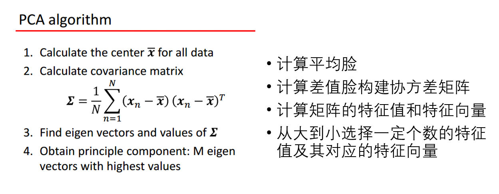
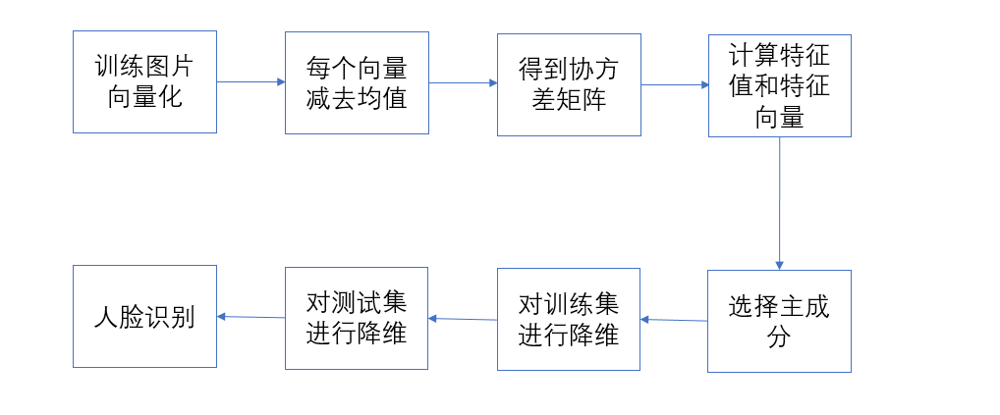
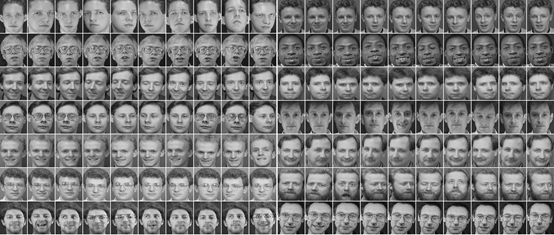
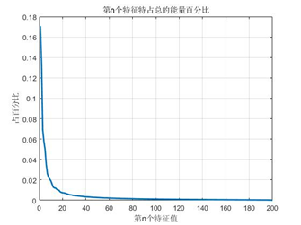
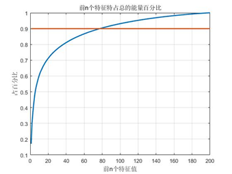

# PCA的应用

本文是上机器学习课的时候做个一个关于pca的presentation，仅供参考

## PCA的主要作用

- 降维

- 投影

## Why PCA

•人脸具有某些相似的特征，这些特征在图像空间中呈现聚类性

•人脸特征形成特征子空间，可以用PCA正交变换基线性近似表示

Sirovish&Kirby:提出用K-L变换表征人脸图片 1990

Turk&Pentland:提出用“特征脸”进行人脸识别 1991

## 关键步骤

## 算法流程

## 结果

ORL人脸数据集共包含40个不同人的400张图像，是在1992年4月至1994年4月期间由英国剑桥的Olivetti研究实验室创建。此数据集下包含40个目录，每个目录下有10张图像，每个目录表示一个不同的人。所有的图像是以PGM格式存储，灰度图，图像大小宽度为92，高度为112。对每一个目录下的图像，这些图像是在不同的时间、不同的光照、不同的面部表情(睁眼/闭眼，微笑/不微笑)和面部细节(戴眼镜/不戴眼镜)环境下采集的。所有的图像是在较暗的均匀背景下拍摄的，拍摄的是正脸(有些带有略微的侧偏)。

计算特征脸所对应的特征值，探究各特征值所占有的能量数。计算第n个特征值占所有特征值之和的百分比 （特征值从小到大排列）。再计算前n个特征值占所有特征值之和的百分比 （特征值从小到大排列）。在实验中，要求保留90%的能量，所以当取前71个特征值得时候就可以满足要求了。

